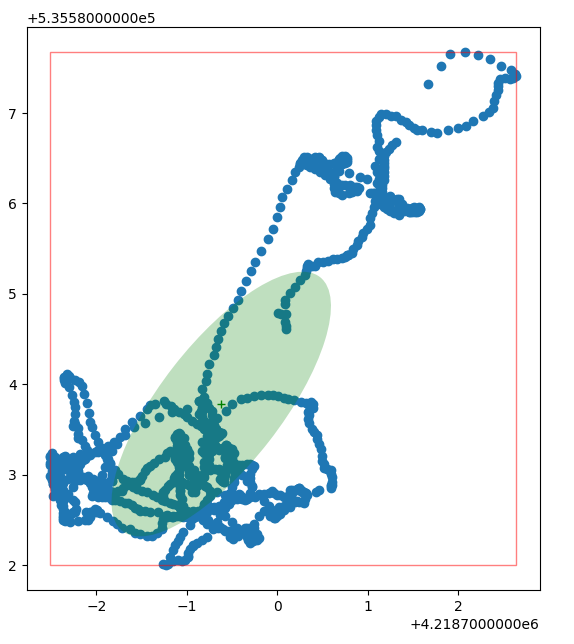

## Setting up RTK GPS on a Raspberry Pi

I want to race RC cars.  I don't want to actually drive them.  I'd probably suck at it.  I'm really pretty sure about that.  So they have to drive themselves.  There are a bunch a ways to get an RC to drive itself.  When you are outside gps is a good choice, but it has to be the right kind of gps and it must be setup the right way.  You also need software to read and interpret the data sent by the gps.  My automonous RC car uses the [DonkeyCar](https://www.donkeycar.com/) framework for small scale car racing, so I'm adding gps support to that framework.  An autonomous car also needs a computer to run the software.  DonkeyCar supports the Raspberry Pi or the Nvidia Jetson Nano as the brains of the car.  I've tried both, but one worked better than the other for this purpose.  More after this commercial break...

  
  
A DonkeyCar

Just kidding, no one would sponsor me.  It turns out that the Raspberry Pi works a little better, but either can work.  I'll talk about both.

First lets talk about gps satellites.  The term GPS (Global Position System) is commonly used to refer to satellite positioning systems generally, but technically it refers to the to American system of positioning satellites provided as a service of the United States government.  Other systems have been added (generally also by governments).  The Russian government provides the GLONASS system; China provides the BeiDou system and the European Union provides the Galileo system.  There are other smaller regional systems, some based on a combination of satellites and land based installations.  The more the merrier; literally, if you get happy about coverage, accuracy and speed.  In this discussion I'll use lower case gps to refer to these system collectively and upper case GPS to refer specifically to the American system.

Next, let's talk about the kinds of gps devices available for talking to the satellite systems.  Since the American GPS system was first early chips only talked to it.  Then when GLONASS came online chips came out that supported both GPS and GLONASS, even simultaneously.  Newer chips support GPS, GLONASS, BeiDou and Galileo and some of the smaller system.  The most popular devices are based on chips created by a company named [U-Blox](https://www.u-blox.com/).  They have lots of different GPS chips for various purposes and with varying capabilities.  Their latest chips are series 10.  You can still find series 6, 7, and 8 out there.  The series 8 chips are much better than 6 or 7; they support more kinds of satellites and more simultaneous satellite connections.  I'm using a device with a series 9 chipset, the F9P; it is a big improvement over series 8 because it supports yet more satellite systems, more simultaneous connections and most importantly, it supports a second frequency band (L2) for higher precision measurements.  Newer is better.  Ask any baby.

U-Blox isn't the only game in town; you can find inexpensive GPS modules that use other chipsets, often from China.  In many ways these can work interchangeably with U-Blox based boards because they all support the a standard way of reading data from the satellites, call NMEA sentences.  This is a line-oriented text protocol.  So if your software can parse NMEA sentences then it can work with most gps modules.  

U-Blox does have an ace up its' sleeve relative to other chipsets; it provides a piece of software called [U-Center](https://www.u-blox.com/en/product/u-center) that can be used to configure and operate U-Blox based devices.  U-Center is written for Microsoft Windows, but it can be run on Macintosh or Linux using the Wine emulation system.  I've successfully done this on Macintosh.  I'll add a section near the end that describes how to use U-Center and how to set it up on Macintosh.

  
  
U-Center

How accurate is gps?

Good question.  Crappy answer: it depends.  Let's just assume you have a great view of the sky; then [GPSInsight](https://help.gpsinsight.com/deep-dive/how-accurate-is-gps-technology/) suggests that gps should yield an accuracy of 2meters CEP (Circular Error Probability); that means that 50% of readings will fall within a circle with a radius of 2m.  The other 50% will be outside.  This is a bit of a weird way to measure accuracy of gps; this is because CEP assumes a Guassian error distribution.  However, if you make a whole bunch of readings over a period of time while staying in one place, you will notice that the errors are not like they; they are more like a random walk.  In fact, the error not really random; much of it is caused by atmospheric changes; these are not really random, but instead cause the position to look like it is moving on a path over time, even though you stay in one place.  Here is an example I created using the gps code I created for DonkeyCar.  It represents 1 sample per second for 100 seconds;

  
  
Gps position readings over time while staying in place; 1 sample per second for 100 seconds

These positions are in [UTM](https://en.wikipedia.org/wiki/Universal_Transverse_Mercator_coordinate_system) units; essentially the position in meters on the surface of the earth.  You can see the readings span about 5 meters vertically and 8.5 meters horizontally.  If we averaged all of these points we would get one measure of the center (the centroid); then we could find the 50 points closest to this center; that would be the CEP.

But the important point is that these are not randomly arranged around the center; instead the position reading is moving around over time like it is walking.  This is because atmospheric affects that change over time. 

Think about this if you are relying on gps readings in order to know where your autonomous car is located; beyond the fact that readings are +/- 4 meters from center, at any given time if you take a few readings it may appear you are quite near a given point, but that is a false assumption. If you keep taking readings and average them, your position will get more accurate, but not in the same way it would if the error was a guassian distribution around a center.  

Here are 1000 readings taken with an U-Blox NEO M8N with an active GPS/GNSS antenna and a good ground plane mounted on a tripod (basically, a good setup; more on antennas and ground planes later).  

  
  
U-Blox NEO M8N position readings over time while staying in place; 1 sample per second for 1000 seconds

The points are within 25 meter range in each direction.  So that is better than the first figure, which was done with a non-active antenna and no base plane.

Next, this is 1000 readings with a U-Blox ZED F9P an active GPS/GNSS antenna and a good ground plane mounted on a tripod, the same setup as the last set of readings.  

  
  
U-Blox ZED F9P position readings over time while staying in place; 1 sample per second for 1000 seconds

The points are within 2.5 meter range vertically and 1.25 meters horizontally.  So that is better than the first figure, which was done with a non-active antenna and no base plane.

This shows the series 9 chipset is superior to the series 8.  But still, this is not accurate enough for navigating a short RC course where the lane may be less than 2 meters wide.  But wait, there is more!

RTK GPS

